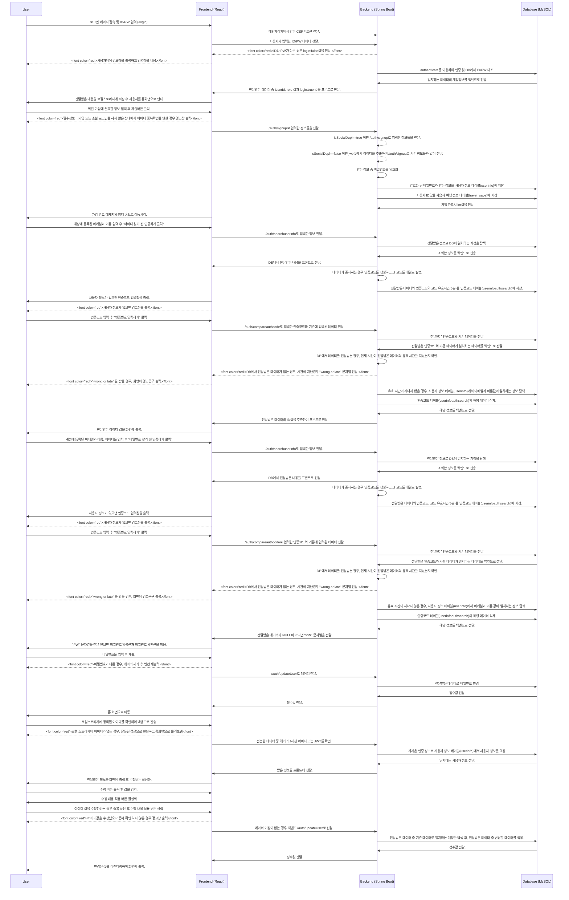

1. 로그인 (POST /auth/login)

```mermaid
sequenceDiagram
    participant User
    participant Frontend as Frontend (React)
    participant Backend as Backend (Spring Boot)
    participant DB as Database (MySQL)
    
%% 1. 로그인
    User->>Frontend: 로그인 페이지 접속 및 ID/PW 입력 (/login)
    Frontend->>Backend: 메인페이지에서 받은 CSRF 토큰 전달.
    Frontend->>Backend: 사용자가 입력한 ID/PW 데이터 전달.
    
    Backend-->>Frontend: <font color="red">ID와 PW가 다른 경우 login:false값을 전달.</font>
    Frontend-->>User : <font color="red">사용자에게 경보창을 출력하고 입력창을 비움.</font>
    
    Backend->>DB: authenticate를 이용하여 인증 및 DB에서 ID/PW 대조
    DB->>Backend: 일치하는 데이터의 계정정보를 백엔드로 전달.
    Backend->>Frontend: 전달받은 데이터 중 UserId, role 값과 login:true 값을 프론트로 전달.
    Frontend->>User : 전달받은 내용을 로컬스토리지에 저장 후 사용자를 홈화면으로 안내. 
    
    
%% 2. 회원가입
    User->>Frontend: 회원 가입에 필요한 정보 입력 후 제출버튼 클릭
    Frontend-->>User : <font color="red">필수정보 미기입 또는 소셜 로그인을 하지 않은 상태에서 아이디 중복확인을 안한 경우 경고창 출력</font>
    Frontend->>Backend: /auth/signup로 입력한 정보들을 전달.
    Backend-->>Backend: isSocialDupl==true 이면 /auth/signup로 입력한 정보들을 전달. 
    Backend-->>Backend: isSocialDupl==false 이면 jwt 값에서 아이디를 추출하여 /auth/signup로 기존 정보들과 같이 전달.
    Backend->>Backend : 받은 정보 중 비밀번호를 암호화
    Backend->>DB: 암호화 된 비밀번호와 받은 정보를 사용자 정보 테이블(userinfo)에 저장
    Backend->>DB: 사용자 ID값을 사용자 여행 정보 테이블(travel_save)에 저장
    DB->>Backend: 가입 완료시 int값을 전달
    Frontend->>User : 가입 완료 메세지와 함께 홈으로 이동시킴.
    
    
%% 3-1. 아이디 찾기
    User->>Frontend: 계정에 등록된 이메일과 이름 입력 후 "아이디 찾기 전 인증하기 클릭"
    Frontend->>Backend: /auth/searchuserinfo로 입력한 정보 전달.
    Backend->>DB: 전달받은 정보로 DB에 일치하는 계정을 탐색.
    DB->>Backend: 조회한 정보를 백엔드로 전송.
    Backend->>Frontend: DB에서 전달받은 내용을 프론트로 전달.
    Backend->>Backend: 데이터가 존재하는 경우 인증코드를 생성하고 그 코드를 메일로 발송.
    Backend->>DB: 전달받은 데이터와 인증코드와 코드 유효시간(5분)을 인증코드 테이블(userinfoauthsearch)에 저장. 
    Frontend->>User : 사용자 정보가 있으면 인증코드 입력창을 출력.
    Frontend-->>User : <font color="red">사용자 정보가 없으면 경고창을 출력.</font>
    User->>Frontend: 인증코드 입력 후 "인증번호 입력하기" 클릭
    Frontend->>Backend: /auth/compareauthcode로 입력한 인증코드와 기존에 입력된 데이터 전달
    Backend->>DB: 전달받은 인증코드와 기존 데이터를 전달
    DB->>Backend : 전달받은 인증코드와 기존 데이터가 일치하는 데이터를 백엔드로 전달.
    Backend->>Backend: DB에서 데이터를 전달받는 경우, 현재 시간이 전달받은 데이터의 유효 시간을 지났는지 확인.
    Backend-->>Frontend: <font color="red">DB에서 전달받은 데이터가 없는 경우, 시간이 지난경우 "wrong or late" 문자열 전달.</font>
    Frontend-->>User: <font color="red">"wrong or late" 를 받을 경우, 화면에 경고문구 출력.</font>
    Backend->>DB:유효 시간이 지나지 않은 경우, 사용자 정보 테이블(userinfo)에서 이메일과 이름값이 일치하는 정보 탐색.
    Backend->>DB:인증코드 테이블(userinfoauthsearch)의 해당 데이터 삭제.
    DB->>Backend : 해당 정보를 백엔드로 전달.
    Backend->>Frontend: 전달받은 데이터의 ID값을 추출하여 프론트로 전달
    Frontend->>User: 전달받은 아이디 값을 화면에 출력. 
    
    
%% 3-2. 비밀번호 변경하기
    User->>Frontend: 계정에 등록된 이메일과 이름, 아이디를 입력 후 "비밀번호 찾기 전 인증하기 클릭"
    Frontend->>Backend: /auth/searchuserinfo로 입력한 정보 전달.
    Backend->>DB: 전달받은 정보로 DB에 일치하는 계정을 탐색.
    DB->>Backend: 조회한 정보를 백엔드로 전송.
    Backend->>Frontend: DB에서 전달받은 내용을 프론트로 전달.
    Backend->>Backend: 데이터가 존재하는 경우 인증코드를 생성하고 그 코드를 메일로 발송.
    Backend->>DB: 전달받은 데이터와 인증코드, 코드 유효시간(5분)을 인증코드 테이블(userinfoauthsearch)에 저장. 
    Frontend->>User : 사용자 정보가 있으면 인증코드 입력창을 출력.
    Frontend-->>User : <font color="red">사용자 정보가 없으면 경고창을 출력.</font>
    User->>Frontend: 인증코드 입력 후 "인증번호 입력하기" 클릭
    Frontend->>Backend: /auth/compareauthcode로 입력한 인증코드와 기존에 입력된 데이터 전달
    Backend->>DB: 전달받은 인증코드와 기존 데이터를 전달
    DB->>Backend : 전달받은 인증코드와 기존 데이터가 일치하는 데이터를 백엔드로 전달.
    Backend->>Backend: DB에서 데이터를 전달받는 경우, 현재 시간이 전달받은 데이터의 유효 시간을 지났는지 확인.
    Backend-->>Frontend: <font color="red">DB에서 전달받은 데이터가 없는 경우, 시간이 지난경우 "wrong or late" 문자열 전달.</font>
    Frontend-->>User: <font color="red">"wrong or late" 를 받을 경우, 화면에 경고문구 출력.</font>
    Backend->>DB:유효 시간이 지나지 않은 경우, 사용자 정보 테이블(userinfo)에서 이메일과 이름 값이 일치하는 정보 탐색.
    Backend->>DB:인증코드 테이블(userinfoauthsearch)의 해당 데이터 삭제.
    DB->>Backend : 해당 정보를 백엔드로 전달.
    Backend->>Frontend: 전달받은 데이터가 NULL이 아니면 "PW" 문자열을 전달.
    Frontend->>User: "PW" 문자열을 전달 받으면 비밀번호 입력란과 비밀번호 확인란을 띄움.
    User->>Frontend: 비밀번호를 입력 후 제출.
    Frontend-->>User: <font color="red">비밀번호가 다른 경우, 데이터 제거 후 빈칸 재출력.</font>
    Frontend->>Backend: /auth/updateUser로 데이터 전달.
    Backend->>DB : 전달받은 데이터로 비밀번호 변경
    DB->>Backend : 정수값 전달.
    Backend->>Frontend : 정수값 전달.
    Frontend->>User: 홈 화면으로 이동.

%% 4. 내 정보 페이지
    User->>Frontend: 로컬스토리지에 등록된 아이디를 확인하여 백엔드로 전송
    Frontend-->>User: <font color="red">로컬 스토리지에 아이디가 없는 경우, 잘못된 접근으로 판단하고 홈화면으로 돌려보냄</font>
    Frontend->>Backend: 전송한 데이터 중 헤더의 J세션 아이디 또는 JWT를 확인.
    Backend->>DB: 가져온 인증 정보로 사용자 정보 테이블(userinfo)에서 사용자 정보를 요청
    DB->>Backend : 일치하는 사용자 정보 전달.
    Backend->>Frontend : 받은 정보를 프론트에 전달.
    Frontend->>User : 전달받은 정보를 화면에 출력 후 수정버튼 활성화.
    User->>Frontend: 수정 버튼 클릭 후 값을 입력.
    Frontend->>User : 수정 내용 적용 버튼 활성화.
    User->>Frontend: 아이디 값을 수정하려는 경우 중복 확인 후 수정 내용 적용 버튼 클릭
    Frontend-->>User : <font color="red">아이디 값을 수정했으나 중복 확인 하지 않은 경우 경고창 출력</font>
    Frontend->>Backend : 데이터 이상이 없는 경우 백엔드 /auth/updateUser로 전달.
    Backend->>DB : 전달받은 데이터 중 기존 데이터로 일치하는 계정을 탐색 후, 전달받은 데이터 중 변경할 데이터를 적용.
    DB->>Backend : 정수값 전달.
    Backend->>Frontend : 정수값 전달.
    Frontend->>User: 변경된 값을 리렌더링하여 화면에 출력.
```