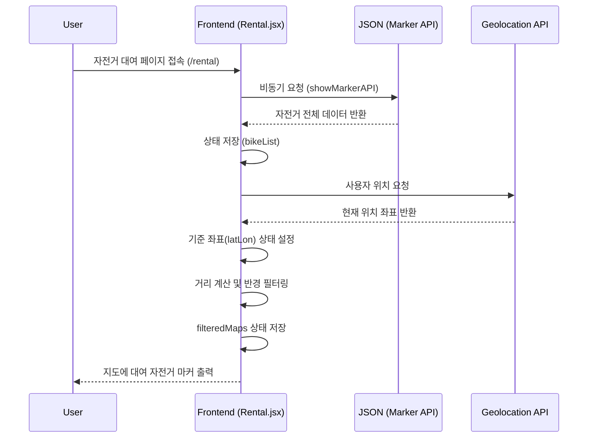
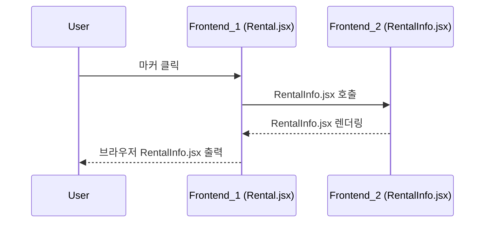
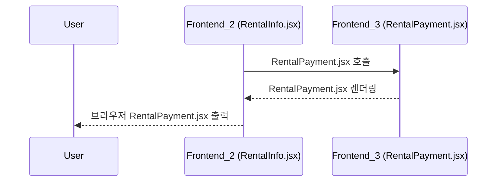
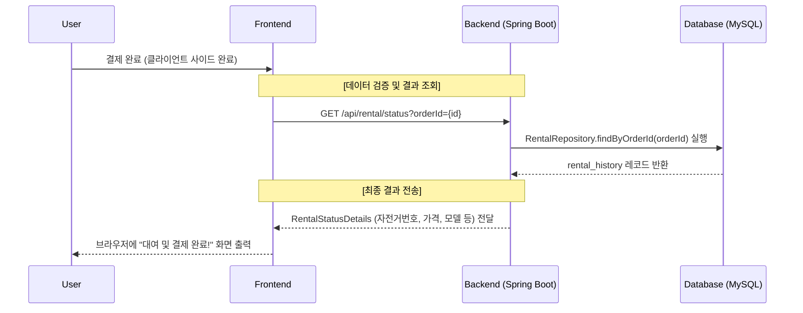

1. 대여 자전거 마커 출력

```mermaid
    sequenceDiagram
        participant User
        participant Frontend as Frontend (Rental.jsx)
        participant API as JSON (Marker API)
        participant GPS as Geolocation API

        User ->> Frontend: 자전거 대여 페이지 접속 (/rental)

        Frontend ->> API: 비동기 요청 (showMarkerAPI)
        API -->> Frontend: 자전거 전체 데이터 반환
        Frontend ->> Frontend: 상태 저장 (bikeList)

        Frontend ->> GPS: 사용자 위치 요청
        GPS -->> Frontend: 현재 위치 좌표 반환
        Frontend ->> Frontend: 기준 좌표(latLon) 상태 설정

        Frontend ->> Frontend: 거리 계산 및 반경 필터링
        Frontend ->> Frontend: filteredMaps 상태 저장

        Frontend -->> User: 지도에 대여 자전거 마커 출력
```

2. 대여 자전거 정보 출력

```mermaid
    sequenceDiagram
        participant User
        participant Frontend_1 as Frontend_1 (Rental.jsx)
        participant Frontend_2 as Frontend_2 (RentalInfo.jsx)

        User ->> Frontend_1: 마커 클릭
        Frontend_1 ->> Frontend_2: RentalInfo.jsx 호출
        Frontend_2 -->> Frontend_1: RentalInfo.jsx 렌더링
        Frontend_1 -->> User: 브라우저 RentalInfo.jsx 출력
```

3. 대여 자전거 결제 화면 출력

```mermaid
    sequenceDiagram
        participant User
        participant Frontend_2 as Frontend_2 (RentalInfo.jsx)
        participant Frontend_3 as Frontend_3 (RentalPayment.jsx)

        Frontend_2 ->> Frontend_3: RentalPayment.jsx 호출
        Frontend_3 -->> Frontend_2: RentalPayment.jsx 렌더링
        Frontend_2 -->> User: 브라우저 RentalPayment.jsx 출력
```

4. 대여 자전거 결제 과정 및 결과 출력

```mermaid
    sequenceDiagram
        participant User
        participant Frontend as Frontend
        participant Backend as Backend (Spring Boot)
        participant DB as Database (MySQL)

        User ->> Frontend: 결제 완료 (클라이언트 사이드 완료)
        
        Note over Frontend, Backend: [데이터 검증 및 결과 조회]
        Frontend ->> Backend: GET /api/rental/status?orderId={id}
        
        Backend ->> DB: RentalRepository.findByOrderId(orderId) 실행
        DB -->> Backend: rental_history 레코드 반환
        
        Note over Backend, Frontend: [최종 결과 전송]
        Backend -->> Frontend: RentalStatusDetails (자전거번호, 가격, 모델 등) 전달
        Frontend -->> User: 브라우저에 "대여 및 결제 완료!" 화면 출력
```