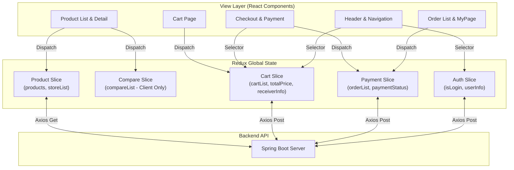

```mermaid
flowchart TD
    subgraph Pages ["View Layer (React Components)"]
        ProductPage[Product List & Detail]
        CartPage[Cart Page]
        CheckoutPage[Checkout & Payment]
        MyPage[Order List & MyPage]
        Header[Header & Navigation]
    end

    subgraph Redux_Store ["Redux Global State"]
        ProductSlice["Product Slice<br/>(products, storeList)"]
        CompareSlice["Compare Slice<br/>(compareList - Client Only)"]
        CartSlice["Cart Slice<br/>(cartList, totalPrice, receiverInfo)"]
        PaymentSlice["Payment Slice<br/>(orderList, paymentStatus)"]
        AuthSlice["Auth Slice<br/>(isLogin, userInfo)"]
    end

    subgraph Server ["Backend API"]
        API[Spring Boot Server]
    end

    %% Connections
    ProductPage -->|Dispatch| ProductSlice
    ProductPage -->|Dispatch| CompareSlice
    
    CartPage -->|Dispatch| CartSlice
    
    CheckoutPage -->|Selector| CartSlice
    CheckoutPage -->|Dispatch| PaymentSlice
    
    MyPage -->|Dispatch| PaymentSlice
    
    Header -->|Selector| AuthSlice
    Header -->|Selector| CartSlice

    %% Async Thunks
    ProductSlice <-->|Axios Get| API
    CartSlice <-->|Axios Post| API
    PaymentSlice <-->|Axios Post| API
    AuthSlice <-->|Axios Post| API
```