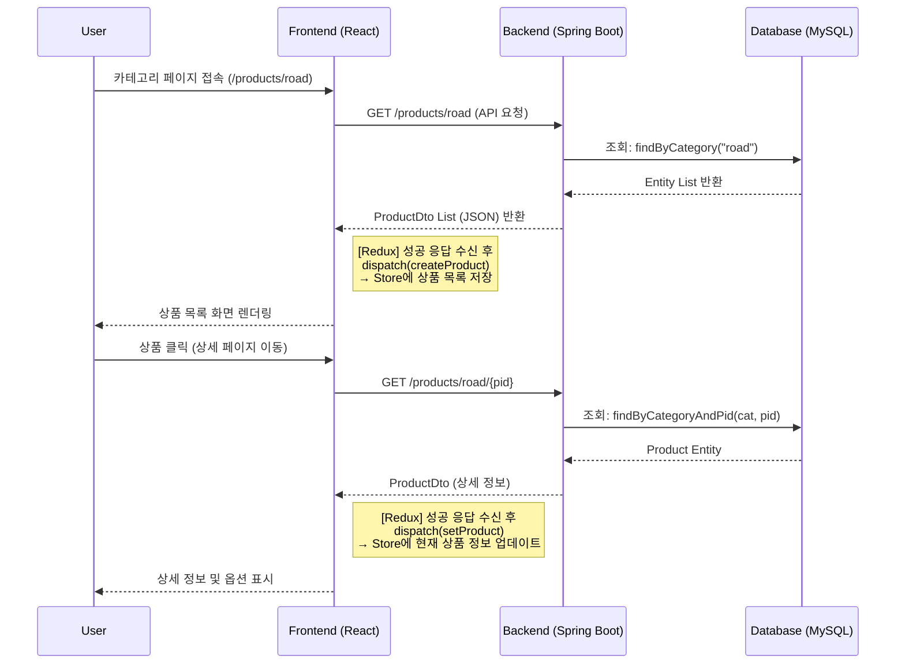

# 기술명세서

# 🚴‍♂️ [프로젝트명] 자전거 이커머스 플랫폼 기술 명세서
4. Product(상품목록조회, 상품 상세조회)

```mermaid
sequenceDiagram
    participant User
    participant Frontend as Frontend (React)
    participant Backend as Backend (Spring Boot)
    participant DB as Database (MySQL)

    %% 1. 상품 목록 조회
    User->>Frontend: 카테고리 페이지 접속 (/products/road)
    Frontend->>Backend: GET /products/road (API 요청)
    Backend->>DB: 조회: findByCategory("road")
    DB-->>Backend: Entity List 반환
    Backend-->>Frontend: ProductDto List (JSON) 반환
    
    Note right of Frontend: [Redux] 성공 응답 수신 후<br/>dispatch(createProduct)<br/>→ Store에 상품 목록 저장
    
    Frontend-->>User: 상품 목록 화면 렌더링

    %% 2. 상품 상세 조회
    User->>Frontend: 상품 클릭 (상세 페이지 이동)
    Frontend->>Backend: GET /products/road/{pid}
    Backend->>DB: 조회: findByCategoryAndPid(cat, pid)
    DB-->>Backend: Product Entity
    Backend-->>Frontend: ProductDto (상세 정보)
    
    Note right of Frontend: [Redux] 성공 응답 수신 후<br/>dispatch(setProduct)<br/>→ Store에 현재 상품 정보 업데이트
    
    Frontend-->>User: 상세 정보 및 옵션 표시
```