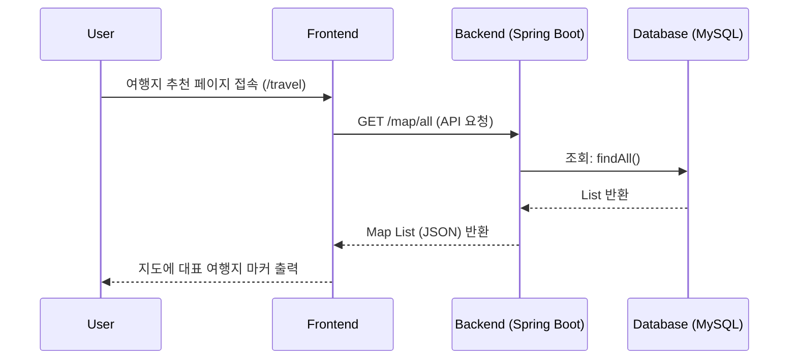
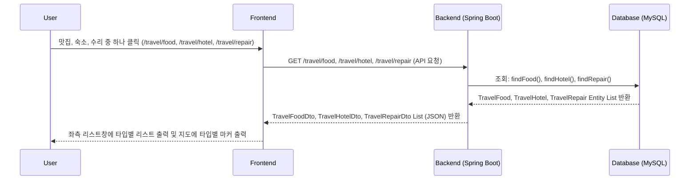
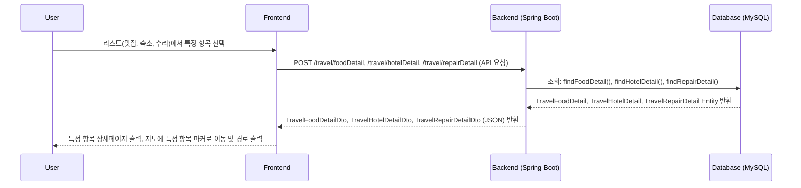
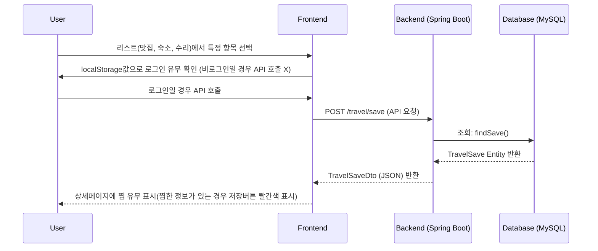
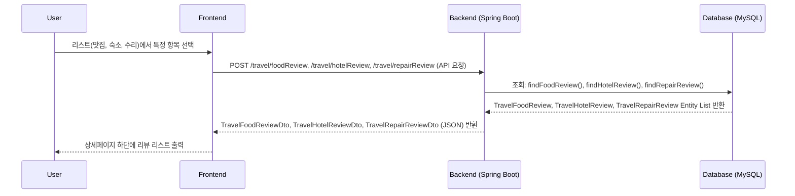
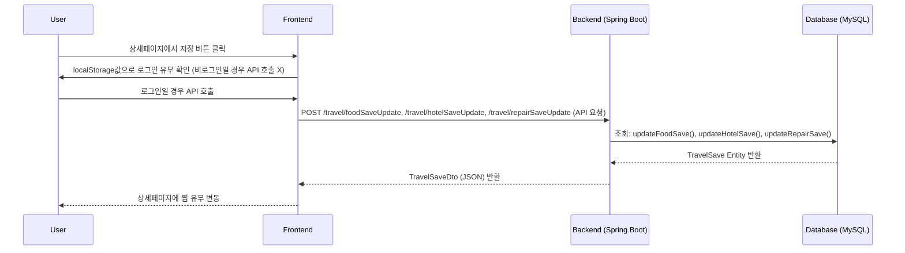
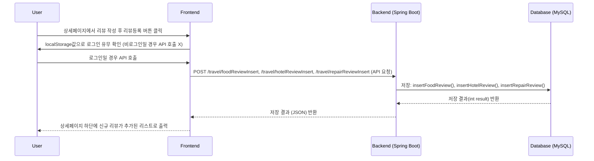

#[List]
1. 대표 여행지 마커 출력 타입별 리스트 및 마커 출력

```mermaid
sequenceDiagram
    participant User
    participant Frontend as Frontend
    participant Backend as Backend (Spring Boot)
    participant DB as Database (MySQL)

    %% 1. 대표 여행지 마커 출력
    User->>Frontend: 여행지 추천 페이지 접속 (/travel)
    Frontend->>Backend: GET /map/all (API 요청)
    Backend->>DB: 조회: findAll()
    DB-->>Backend: List 반환
    Backend-->>Frontend: Map List (JSON) 반환    
    Frontend-->>User: 지도에 대표 여행지 마커 출력
```

2. 타입별 리스트 및 마커 출력

```mermaid
sequenceDiagram
    participant User
    participant Frontend as Frontend
    participant Backend as Backend (Spring Boot)
    participant DB as Database (MySQL)
    
    %% 2. 타입별 리스트 및 마커 출력
    User->>Frontend: 맛집, 숙소, 수리 중 하나 클릭 (/travel/food, /travel/hotel, /travel/repair)
    Frontend->>Backend: GET /travel/food, /travel/hotel, /travel/repair (API 요청)
    Backend->>DB: 조회: findFood(), findHotel(), findRepair()
    DB-->>Backend: TravelFood, TravelHotel, TravelRepair Entity List 반환
    Backend-->>Frontend: TravelFoodDto, TravelHotelDto, TravelRepairDto List (JSON) 반환        
    Frontend-->>User: 좌측 리스트창에 타입별 리스트 출력 및 지도에 타입별 마커 출력
```

#[Detail]
1. 상세페이지 출력

```mermaid
sequenceDiagram
    participant User
    participant Frontend as Frontend
    participant Backend as Backend (Spring Boot)
    participant DB as Database (MySQL)

    %% 1. 상세페이지 출력
    User->>Frontend: 리스트(맛집, 숙소, 수리)에서 특정 항목 선택
    Frontend->>Backend: POST /travel/foodDetail, /travel/hotelDetail, /travel/repairDetail (API 요청)
    Backend->>DB: 조회: findFoodDetail(), findHotelDetail(), findRepairDetail()
    DB-->>Backend: TravelFoodDetail, TravelHotelDetail, TravelRepairDetail Entity 반환
    Backend-->>Frontend: TravelFoodDetailDto, TravelHotelDetailDto, TravelRepairDetailDto (JSON) 반환    
    Frontend-->>User: 특정 항목 상세페이지 출력, 지도에 특정 항목 마커로 이동 및 경로 출력 
```

2. 회원별 찜 정보 가져오기

```mermaid
sequenceDiagram
    participant User
    participant Frontend as Frontend
    participant Backend as Backend (Spring Boot)
    participant DB as Database (MySQL)

    %% 2. 회원별 찜 정보 가져오기
    User->>Frontend: 리스트(맛집, 숙소, 수리)에서 특정 항목 선택
    Frontend->>User: localStorage값으로 로그인 유무 확인 (비로그인일 경우 API 호출 X)
    User->>Frontend: 로그인일 경우 API 호출
    Frontend->>Backend: POST /travel/save (API 요청)
    Backend->>DB: 조회: findSave()
    DB-->>Backend: TravelSave Entity 반환
    Backend-->>Frontend: TravelSaveDto (JSON) 반환    
    Frontend-->>User: 상세페이지에 찜 유무 표시(찜한 정보가 있는 경우 저장버튼 빨간색 표시)
```

3. 리뷰 리스트 출력

```mermaid
sequenceDiagram
    participant User
    participant Frontend as Frontend
    participant Backend as Backend (Spring Boot)
    participant DB as Database (MySQL)

    %% 3. 리뷰 리스트 출력
    User->>Frontend: 리스트(맛집, 숙소, 수리)에서 특정 항목 선택
    Frontend->>Backend: POST /travel/foodReview, /travel/hotelReview, /travel/repairReview (API 요청)
    Backend->>DB: 조회: findFoodReview(), findHotelReview(), findRepairReview()
    DB-->>Backend: TravelFoodReview, TravelHotelReview, TravelRepairReview Entity List 반환
    Backend-->>Frontend: TravelFoodReviewDto, TravelHotelReviewDto, TravelRepairReviewDto (JSON) 반환    
    Frontend-->>User: 상세페이지 하단에 리뷰 리스트 출력
```

4. 회원별 찜 수정

```mermaid
sequenceDiagram
    participant User
    participant Frontend as Frontend
    participant Backend as Backend (Spring Boot)
    participant DB as Database (MySQL)

    %% 4. 회원별 찜 수정
    User->>Frontend: 상세페이지에서 저장 버튼 클릭
    Frontend->>User: localStorage값으로 로그인 유무 확인 (비로그인일 경우 API 호출 X)
    User->>Frontend: 로그인일 경우 API 호출
    Frontend->>Backend: POST /travel/foodSaveUpdate, /travel/hotelSaveUpdate, /travel/repairSaveUpdate (API 요청)
    Backend->>DB: 조회: updateFoodSave(), updateHotelSave(), updateRepairSave()
    DB-->>Backend: TravelSave Entity 반환
    Backend-->>Frontend: TravelSaveDto (JSON) 반환    
    Frontend-->>User: 상세페이지에 찜 유무 변동 
```

5. 리뷰 작성

```mermaid
sequenceDiagram
    participant User
    participant Frontend as Frontend
    participant Backend as Backend (Spring Boot)
    participant DB as Database (MySQL)

    %% 5. 리뷰 작성
    User->>Frontend: 상세페이지에서 리뷰 작성 후 리뷰등록 버튼 클릭
    Frontend->>User: localStorage값으로 로그인 유무 확인 (비로그인일 경우 API 호출 X)
    User->>Frontend: 로그인일 경우 API 호출
    Frontend->>Backend: POST /travel/foodReviewInsert, /travel/hotelReviewInsert, /travel/repairReviewInsert (API 요청)
    Backend->>DB: 저장: insertFoodReview(), insertHotelReview(), insertRepairReview()
    DB-->>Backend: 저장 결과(int result) 반환
    Backend-->>Frontend: 저장 결과 (JSON) 반환    
    Frontend-->>User: 상세페이지 하단에 신규 리뷰가 추가된 리스트로 출력
```
